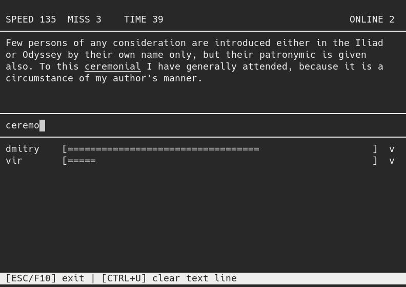

## kbrace
typing on time, multiplayer game

  

### Requirements
You must have a `ncurses` library

### Build
Clone the repository and run `make` to generate the server and client programs. Run the server (occupying port 1337) on a machine which is accessible to all clients. 

### Run
Start server `./kbrace_server`  
Start client `./kbrace_client <server-ip>`

